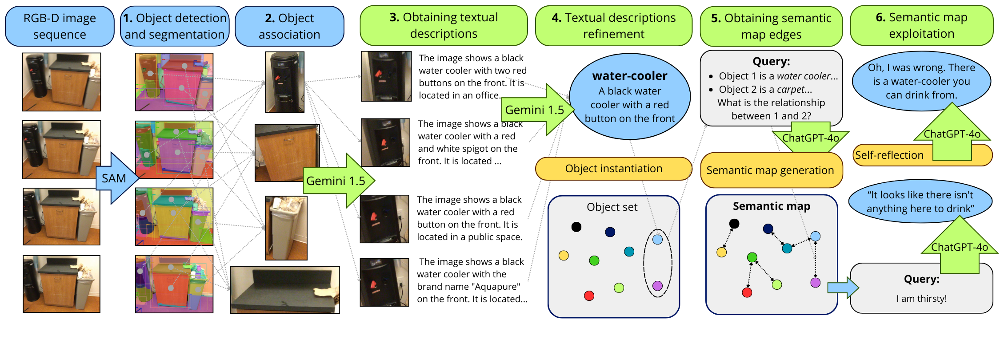

# semantics-maps-moncada

Code for the B.Sc. Final Thesis: "Building and Exploiting Semantic Maps in Robotics Using Large Models".
- Author: [Jesús Moncada Ramírez](https://github.com/jemonra), University of Málaga, academic year 2023-2024.

## 1. Overview

Mobile robots benefit from semantic maps that augment geometry and topology with object properties, functions, and relationships—crucial in HRI scenarios. Traditional pipelines rely on closed‑set detectors and fixed ontologies. This project adopts Large Vision–Language Models (LVLMs) and Large Language Models (LLMs) to support an open set of categories and dynamic semantics.

Built on [ConceptGraphs](https://concept-graphs.github.io/), the pipeline uses:
- Segment Anything (SAM) for object segmentation
- CLIP for feature extraction
- Gemini 1.5 Pro for textual descriptions
- ChatGPT-4o for relationship inference

RGB‑D inputs are converted into a scene graph where nodes are objects and edges are semantic relations. Validation spans synthetic (Replica) and real‑world (ScanNet) datasets. The maps are further exploited in an HRI setting through an LLM‑based chatbot with self‑reflection to refine answers.

This work resulted in a paper presented at the conference Jornadas de Automática 2024 (Málaga, Spain) titled [_"Modelos a gran escala para mapeo semántico en robótica móvil"_](https://revistas.udc.es/index.php/JA_CEA/article/view/10940) (_Large models for semantic mapping in mobile robotics_).

## 2. Repository Contents

The code is organized as follows:

### `concept-graphs/`

This folder contains a customized copy of the [ConceptGraphs](https://concept-graphs.github.io/) code. We applied several changes to the original project so it works within our pipeline. To run the complete system, install **this modified version** of ConceptGraphs instead of the upstream release.

### `ConceptGraphsTesting.ipynb`

This Jupyter notebook was created to run the original ConceptGraphs pipeline inside **Google Colab**. It provides an easy way to experiment with the ConceptGraphs code and to inspect or visualize the results it generates,  
without needing a full local installation. Use it to quickly test functions, modify parameters, and review output semantic maps in an interactive environment.

### `src/`

Contains all Python source code for post-processing and using the open-vocabulary semantic maps produced by the pipeline.  
The code is organized into several subfolders:

- `dataset/` – Dataset utilities and loaders.
  - `Robot@VirtualHome`: used for experimental tests.
  - `ScanNet`: real 3D indoor scans for validation.
- `llm/` – Interfaces for Large Language Models.
  - `Gemini`: creates textual descriptions of objects and scenes.
  - `ChatGPT`: infers object relationships and provides context for HRI.
- `prompt/` – Prompt files used to query the LLMs and guide their output.
- `slam/` – Classes and functions for handling Simultaneous Localization and Mapping (SLAM) results.
- `utils/` – General utilities such as data handling helpers, geometry tools, and I/O functions.

### `data/`
Contains sample outputs of the method:
- `replica_semantic_map.json` – Semantic map generated for the `room0` sequence of the Replica dataset.
- `scannet_semantic_map.json` – Semantic map generated for the `scene0003_02` sequence of the ScanNet dataset.

### `scripts/`
Executable scripts to run the full pipeline on different datasets.  
Before using them, install the required libraries and datasets following the
[ConceptGraphs instructions](https://github.com/concept-graphs/concept-graphs).  
You can skip the LLaVA installation, as this project replaces it with `Gemini` and `ChatGPT`.

Script name prefixes indicate the dataset and phase:
- `cg*`, `cgf*`, `replica*` – Run processes on Replica sequences.
- `ravh*` – Run processes on Robot@VirtualHome (experimental, not all phases implemented).
- `sn*` – Run processes on ScanNet sequences.

## 3. Documentation

For a detailed explanation of the semantic mapping method developed and the exploitation of the generated semantic maps, refer to:
- [Thesis Final Report](docs/Memoria.pdf)
- [Thesis Presentation Slides](docs/Presentacion.pdf)